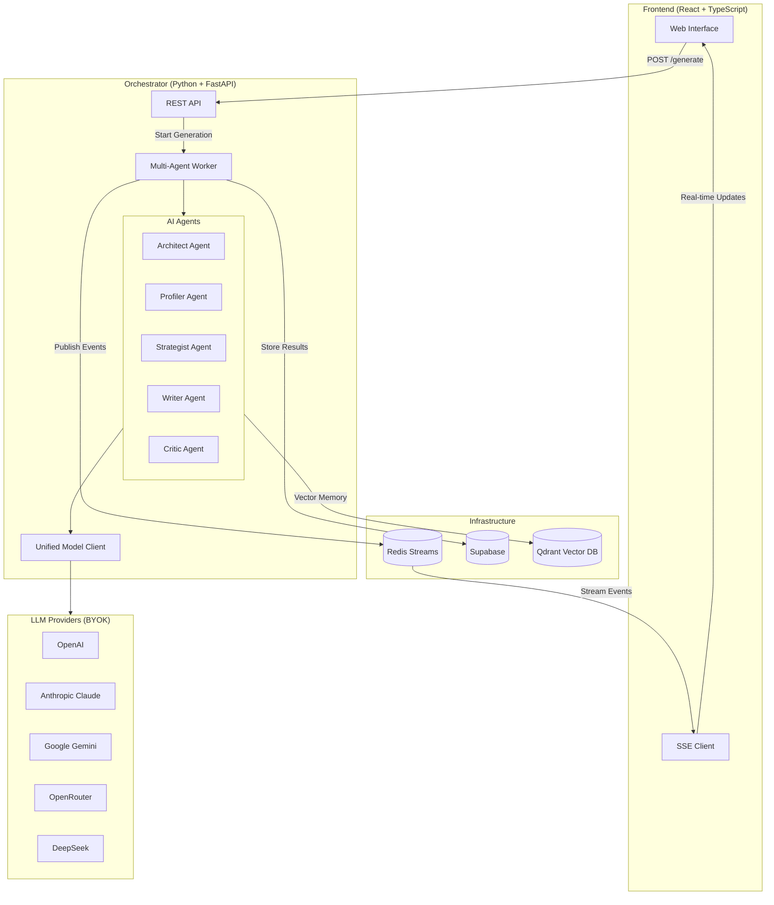
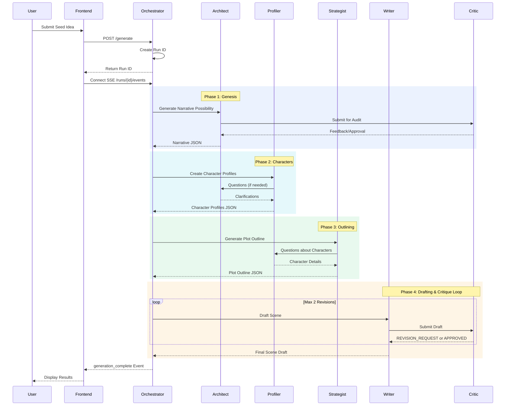
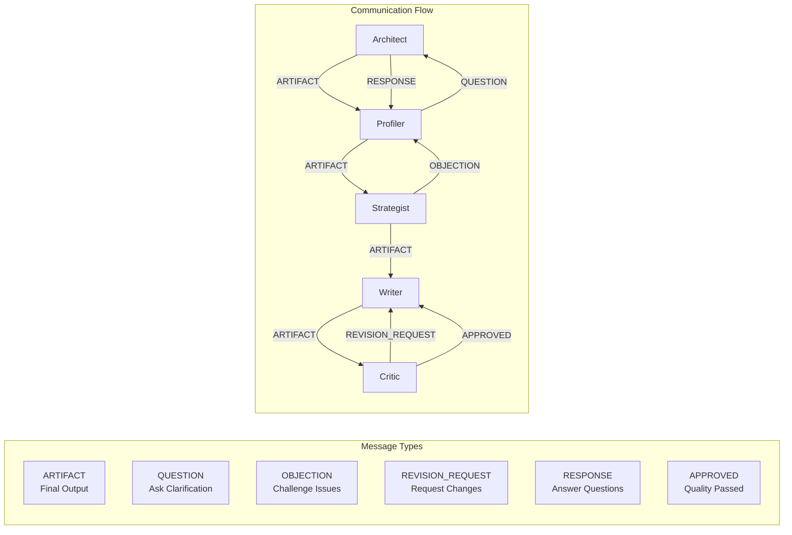

# MANOE - Multi-Agent Narrative Orchestration Engine

A scalable, event-driven platform designed to automate the creation of exceptional narratives by strictly adhering to proven storytelling principles from the "Storyteller" framework. MANOE uses a multi-agent architecture where specialized AI agents collaborate in real-time to generate compelling stories.

## System Architecture



## Agent Workflow



## Agent Communication Protocol



## Features

MANOE provides a comprehensive set of features for narrative generation. The multi-agent architecture employs specialized AI agents including Architect, Profiler, Strategist, Writer, and Critic that collaborate to create narratives. The system supports BYOK (Bring Your Own Key) integration with OpenAI, OpenRouter, Google Gemini, Anthropic Claude, and DeepSeek. Users can select different models for each agent based on their needs and budget. The platform is self-hosting ready with a complete Docker Compose setup for easy deployment. Vector memory through Qdrant integration ensures character and worldbuilding consistency. The Moral Compass Framework allows narratives to be generated through Ethical, Unethical, Amoral, or Ambiguous lenses. Real-time progress updates are delivered via Server-Sent Events (SSE) through Redis Streams. The agent editing feature allows users to edit agent outputs and regenerate dependent agents while locking approved content.

## Quick Start with Docker

The fastest way to get started is using Docker Compose:

```bash
# Clone the repository
git clone https://github.com/IShalkin/manoe.git
cd manoe

# Configure your API keys
cp .env.example .env
# Edit .env with your API keys (at least one LLM provider required)

# Start all services
docker-compose up -d

# Access the frontend at http://localhost:5173
# Access the orchestrator at http://localhost:8001
```

## Supported LLM Providers (BYOK)

MANOE supports multiple LLM providers. Configure at least one:

| Provider | Models | Best For |
|----------|--------|----------|
| **OpenAI** | gpt-4o, gpt-4o-mini, gpt-4-turbo, o1-preview, o1-mini | General purpose, best quality |
| **OpenRouter** | Access to 100+ models from multiple providers | Cost optimization, model variety |
| **Google Gemini** | gemini-2.0-flash-exp, gemini-1.5-pro, gemini-1.5-flash | Long context (1M tokens) |
| **Anthropic Claude** | claude-3.5-sonnet, claude-3.5-haiku, claude-3-opus | Creative writing, safety |
| **DeepSeek** | deepseek-chat, deepseek-coder | Cost-effective alternative |

### Per-Agent Model Configuration

Each agent can use a different provider and model:

```env
# High-capability models for complex reasoning
ARCHITECT_PROVIDER=openai
ARCHITECT_MODEL=gpt-4o

# Cost-effective model for high-volume drafting
WRITER_PROVIDER=openai
WRITER_MODEL=gpt-4o-mini

# Mix providers as needed
CRITIC_PROVIDER=claude
CRITIC_MODEL=claude-3-5-sonnet-20241022
```

## Project Structure

```
manoe/
├── frontend/              # React + TypeScript + Vite Frontend
│   ├── src/
│   │   ├── components/    # UI components (AgentChat, Layout, etc.)
│   │   ├── contexts/      # React contexts (Auth, Settings)
│   │   ├── hooks/         # Custom hooks (useProjects, useSettings)
│   │   ├── pages/         # Page components
│   │   └── lib/           # Utilities and Supabase client
│   └── package.json
├── orchestrator/          # Python/FastAPI AI Orchestrator
│   ├── agents/            # Agent definitions
│   ├── prompts/           # System prompts derived from Storyteller
│   ├── services/          # Redis Streams, Model Client
│   ├── models/            # Pydantic data models
│   ├── config/            # Configuration management
│   ├── autogen_orchestrator.py  # StorytellerGroupChat implementation
│   ├── multi_agent_worker.py    # FastAPI app with SSE endpoints
│   └── pyproject.toml
├── supabase/              # Supabase configuration and migrations
├── docs/                  # Documentation
└── docker-compose.yml     # Docker Compose configuration
```

## Agentic Workflow

The system implements a four-phase narrative generation workflow:

### Phase 1: Genesis (Architect Agent)
The Architect accepts a "Seed Idea" from the user (What If? questions, image prompts) and configures the "Moral Compass" (Ethical, Unethical, Amoral, Ambiguous). It generates a structured "Narrative Possibility" JSON that defines the story's foundation, including plot summary, setting, main conflict, and thematic elements.

### Phase 2: Character & World Design (Profiler Agent)
The Profiler assigns archetypes (Hero, Shadow, Trickster) to characters and generates "Core Psychological Wound" and "Inner Trap" for protagonists. Character attributes can be stored as vectors in Qdrant for consistency across the narrative.

### Phase 3: Plotting & Outlining (Strategist Agent)
The Strategist maps the plot onto "Mythic Structure" (Hero's Journey, Three-Act Structure) and creates a scene-by-scene outline with conflict, emotional beats, and subtext.

### Phase 4: Drafting & Critique Loop (Writer + Critic Agents)
The Writer drafts scenes using "Show, Don't Tell" principles while the Critic validates pacing, originality, dialogue, and subtext. This phase involves iterative refinement with a maximum of 2 revision rounds per scene until quality standards are met.

## API Endpoints

### Orchestrator API (Port 8001)

| Endpoint | Method | Description |
|----------|--------|-------------|
| `/health` | GET | Health check |
| `/generate` | POST | Start multi-agent generation |
| `/runs/{run_id}/events` | GET | SSE stream for real-time events |
| `/runs/{run_id}/messages` | GET | Get all agent messages for a run |

### Generate Request Body

```json
{
  "seed_idea": "What if a detective could see the last 10 seconds of a murder victim's life?",
  "moral_compass": "ambiguous",
  "target_audience": "Adult thriller readers",
  "themes": "justice,memory,truth",
  "provider": "openai",
  "model": "gpt-4o",
  "api_key": "your-api-key",
  "constraints": null
}
```

## Environment Variables

### Frontend
- `VITE_SUPABASE_URL` - Supabase project URL
- `VITE_SUPABASE_ANON_KEY` - Supabase anonymous key
- `VITE_ORCHESTRATOR_URL` - Orchestrator API URL

### Orchestrator
- `REDIS_URL` - Redis connection URL
- `SUPABASE_URL` - Supabase project URL
- `SUPABASE_KEY` - Supabase service key
- `QDRANT_URL` - Qdrant server URL (optional)

## Development Setup

### Frontend

```bash
cd frontend
npm install
cp .env.example .env
# Configure environment variables
npm run dev
```

### Orchestrator

```bash
cd orchestrator
poetry install
cp .env.example .env
# Configure environment variables
poetry run python multi_agent_worker.py
```

## Deployment

For VPS deployment, use the provided `docker-compose.vps.yml`:

```bash
# On your VPS
docker-compose -f docker-compose.vps.yml up -d
```

The VPS configuration includes nginx-proxy integration for automatic SSL certificates via Let's Encrypt.

## Success Metrics

The system aims for high-quality narrative output measured by structural adherence (100% of scenes match the generated outline), psychological depth (every protagonist has defined "Inner Trap" and "Breaking Point"), and sensory density (every scene contains at least 3 distinct sensory details).

## License

MIT License

## Contributing

Contributions are welcome! Please read the contributing guidelines before submitting PRs.
