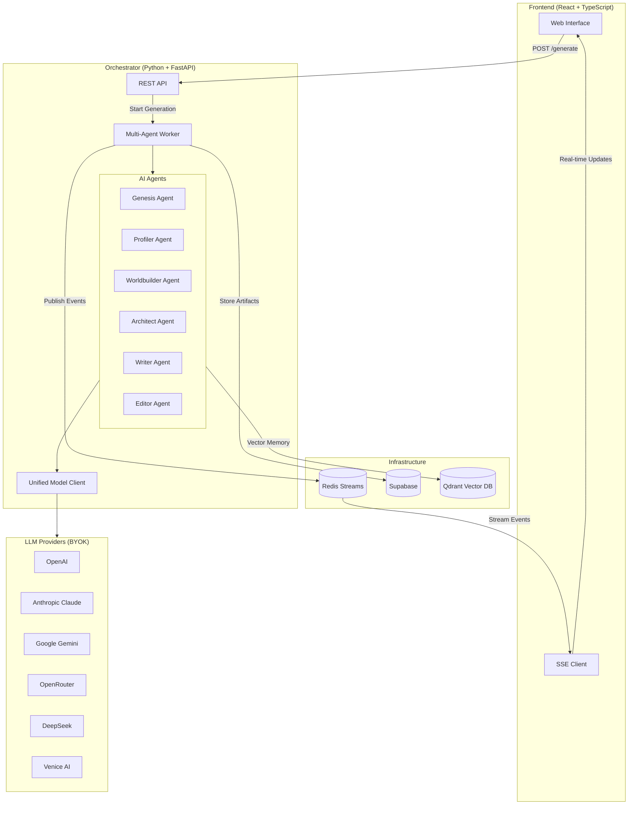
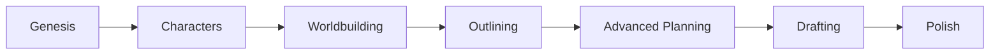

# MANOE - Multi-Agent Narrative Orchestration Engine

A scalable, event-driven platform designed to automate the creation of exceptional narratives by strictly adhering to proven storytelling principles from the "Storyteller" framework. MANOE uses a multi-agent architecture where specialized AI agents collaborate in real-time to generate compelling stories.

## Live Demo

- **Frontend**: https://manoe.iliashalkin.com
- **Orchestrator API**: https://manoe-orchestrator.iliashalkin.com

## System Architecture



## Generation Workflow

MANOE implements a **7-phase narrative generation workflow**:



### Phase 1: Genesis
The Genesis agent accepts a "Seed Idea" from the user (What If? questions, image prompts) and configures the "Moral Compass" (Ethical, Unethical, Amoral, Ambiguous). It generates a structured "Narrative Possibility" JSON that defines the story's foundation, including plot summary, setting, main conflict, and thematic elements.

### Phase 2: Characters (Profiler Agent)
The Profiler assigns archetypes (Hero, Shadow, Trickster) to characters and generates "Core Psychological Wound" and "Inner Trap" for protagonists. Character attributes are stored as vectors in Qdrant for consistency across the narrative.

### Phase 3: Worldbuilding
The Worldbuilder creates detailed world elements including locations, cultures, rules, and atmosphere. These elements are stored in Qdrant vector memory for retrieval during scene writing.

### Phase 4: Outlining (Architect Agent)
The Architect maps the plot onto "Mythic Structure" (Hero's Journey, Three-Act Structure) and creates a scene-by-scene outline with conflict, emotional beats, and subtext.

### Phase 5: Advanced Planning
Generates detailed planning artifacts including contradiction maps, emotional beat sheets, sensory blueprints, subtext design, and complexity checklists to ensure narrative coherence.

### Phase 6: Drafting (Writer Agent)
The Writer drafts scenes using "Show, Don't Tell" principles. Each scene is written with full context from Qdrant memory including relevant characters, worldbuilding elements, and previous scenes for continuity.

### Phase 7: Polish (Editor Agent)
The Editor refines the draft with iterative quality checks, validating pacing, originality, dialogue, and subtext. This phase involves up to 2 revision rounds per scene until quality standards are met.

## Key Features

### Selective Regeneration

MANOE supports two types of selective regeneration for iterative refinement:

**Phase-Based Regeneration**: Edit any agent's output and regenerate from that phase onwards. Previous phases are preserved using stored artifacts from Supabase. Use the "What did you change?" field to pass instructions to the AI about your modifications.

**Scene-Level Regeneration**: Select specific scenes to regenerate via the Writer agent's modal UI. The system maintains continuity between old and new scenes using Qdrant memory context.

### Memory Context System

The system uses Qdrant vector database to maintain narrative consistency:

- **Character Memory**: Character profiles are embedded and retrieved based on scene relevance
- **Worldbuilding Memory**: World elements are stored and retrieved for consistent world details
- **Scene Memory**: Previous scenes are embedded for continuity in subsequent scenes

### Artifact Persistence

All generation artifacts are stored in Supabase for resuming interrupted generations, phase-based selective regeneration, scene-level selective regeneration, and project history/versioning.

### Multi-Provider LLM Support (BYOK)

MANOE supports multiple LLM providers with BYOK (Bring Your Own Key). Configure at least one provider to get started.

## Quick Start with Docker

The fastest way to get started is using Docker Compose:

```bash
# Clone the repository
git clone https://github.com/IShalkin/manoe.git
cd manoe

# Configure your API keys
cp .env.example .env
# Edit .env with your API keys (at least one LLM provider required)

# Start all services
docker-compose up -d

# Access the frontend at http://localhost:5173
# Access the orchestrator API at http://localhost:8001
```

### Docker Services

The docker-compose.yml includes the following services:

| Service | Port | Description |
|---------|------|-------------|
| **frontend** | 5173 | React + TypeScript + Vite web interface |
| **orchestrator** | 8001 | Python FastAPI AI orchestrator with SSE |
| **redis** | 6379 | Message broker for real-time SSE events |
| **qdrant** | 6333 | Vector database for character/worldbuilding memory |

### Environment Variables for Docker

Create a `.env` file in the root directory with your API keys:

```env
# Required: At least one LLM provider
OPENAI_API_KEY=your-openai-key
# Or use other providers:
# ANTHROPIC_API_KEY=your-anthropic-key
# GEMINI_API_KEY=your-gemini-key
# VENICE_API_KEY=your-venice-key

# Optional: Supabase for persistence
VITE_SUPABASE_URL=your-supabase-url
VITE_SUPABASE_ANON_KEY=your-supabase-anon-key
```

### Supported LLM Providers

| Provider | Top Models | Best For |
|----------|------------|----------|
| **OpenAI** | GPT-4o, GPT-4-turbo, O1 | Reasoning, general purpose |
| **Google Gemini** | Gemini 2.0 Flash, Gemini 1.5 Pro | Long context (2M tokens), complex logic |
| **Anthropic Claude** | Claude 3.5 Sonnet, Claude 3 Opus | Creative writing, prose quality |
| **Venice AI** | Dolphin Mistral, Llama 3.1 | Uncensored content, dark themes |
| **DeepSeek** | DeepSeek V3, DeepSeek R1 | Cost-effective reasoning |
| **OpenRouter** | Access to all above via single API | Cost optimization, model variety |

### Moral Compass Framework

Generate narratives through different ethical lenses:
- **Ethical**: Traditional hero's journey with clear moral lessons
- **Unethical**: Villain protagonists, morally dark narratives
- **Amoral**: Neutral perspective without moral judgment
- **Ambiguous**: Complex moral situations without clear answers

## Project Structure

```
manoe/
├── frontend/                    # React + TypeScript + Vite Frontend
│   ├── src/
│   │   ├── components/          # UI components
│   │   │   ├── AgentChat.tsx    # Agent cards and regeneration modals
│   │   │   ├── Layout.tsx       # App layout
│   │   │   └── SettingsModal.tsx
│   │   ├── contexts/            # React contexts (Auth, Settings)
│   │   ├── hooks/               # Custom hooks (useProjects, useSettings)
│   │   ├── pages/
│   │   │   ├── GenerationPage.tsx  # Main generation UI
│   │   │   ├── DashboardPage.tsx
│   │   │   └── ...
│   │   └── lib/                 # Utilities and Supabase client
│   └── package.json
├── orchestrator/                # Python/FastAPI AI Orchestrator
│   ├── services/
│   │   ├── supabase_persistence.py  # Artifact storage
│   │   ├── qdrant_memory.py         # Vector memory
│   │   ├── redis_streams.py         # SSE event streaming
│   │   └── model_client.py          # Multi-provider LLM client
│   ├── autogen_orchestrator.py      # Main orchestrator with phase functions
│   ├── multi_agent_worker.py        # API endpoints and SSE streaming
│   └── pyproject.toml
├── supabase/                    # Supabase configuration and migrations
├── docs/                        # Documentation
├── docker-compose.yml           # Docker Compose for local development
└── docker-compose.vps.yml       # Docker Compose for VPS deployment
```

## Supabase Schema

The following tables are used for persistence:

| Table | Description |
|-------|-------------|
| **projects** | User projects with seed_idea, settings, moral_compass |
| **run_artifacts** | Phase artifacts (project_id UUID FK, run_id, phase, artifact_type, content JSONB) |
| **characters** | Generated character profiles |
| **worldbuilding** | World elements and settings |
| **outlines** | Plot outlines with scene breakdowns |
| **drafts** | Scene drafts with narrative content |
| **critiques** | Editor feedback and quality scores |

## API Endpoints

### Orchestrator API (Port 8001)

| Endpoint | Method | Description |
|----------|--------|-------------|
| `/health` | GET | Health check |
| `/generate` | POST | Start multi-agent generation |
| `/runs/{run_id}/events` | GET | SSE stream for real-time events |
| `/runs/{run_id}/messages` | GET | Get all agent messages for a run |
| `/runs/{run_id}/cancel` | POST | Cancel a running generation |
| `/runs/{run_id}/pause` | POST | Pause a running generation |
| `/runs/{run_id}/resume` | POST | Resume a paused generation |

### Generate Request Body

```json
{
  "seed_idea": "What if a detective could see the last 10 seconds of a murder victim's life?",
  "moral_compass": "ambiguous",
  "target_audience": "Adult thriller readers",
  "themes": "justice,memory,truth",
  "provider": "openai",
  "model": "gpt-4o",
  "api_key": "your-api-key",
  "supabase_project_id": "uuid-of-project",
  "start_from_phase": "characters",
  "previous_run_id": "uuid-of-previous-run",
  "scenes_to_regenerate": [2, 5],
  "constraints": {
    "edit_comment": "Make the protagonist more conflicted about their abilities"
  }
}
```

## Environment Variables

### Frontend
- `VITE_SUPABASE_URL` - Supabase project URL
- `VITE_SUPABASE_ANON_KEY` - Supabase anonymous key
- `VITE_ORCHESTRATOR_URL` - Orchestrator API URL

### Orchestrator
- `REDIS_URL` - Redis connection URL
- `SUPABASE_URL` - Supabase project URL
- `SUPABASE_KEY` - Supabase service key (required for artifact persistence)
- `QDRANT_URL` - Qdrant server URL (required for memory context features)

## Development Setup

### Frontend

```bash
cd frontend
npm install
cp .env.example .env
# Configure environment variables
npm run dev
```

### Orchestrator

```bash
cd orchestrator
poetry install
cp .env.example .env
# Configure environment variables
poetry run python multi_agent_worker.py
```

## Deployment

For VPS deployment, use the provided `docker-compose.vps.yml`:

```bash
# On your VPS
docker compose -f docker-compose.vps.yml up -d
```

The VPS configuration includes nginx-proxy integration for automatic SSL certificates via Let's Encrypt.

## Success Metrics

The system aims for high-quality narrative output measured by structural adherence (100% of scenes match the generated outline), psychological depth (every protagonist has defined "Inner Trap" and "Breaking Point"), and sensory density (every scene contains at least 3 distinct sensory details).

## License

This project is licensed under the **Creative Commons Attribution-NonCommercial-ShareAlike 4.0 International License (CC BY-NC-SA 4.0)**.

You are free to share and adapt this work for non-commercial purposes, provided you give appropriate credit and distribute any derivative works under the same license.

**Citation:**
```
Shalkin, I. (2025). MANOE: Multi-Agent Narrative Orchestration Engine. 
GitHub. https://github.com/IShalkin/manoe
```

For commercial licensing inquiries, contact: mailtoshalkin@gmail.com

See [LICENSE](LICENSE) for full details.

## Contributing

Contributions are welcome! Please read the contributing guidelines before submitting PRs.
