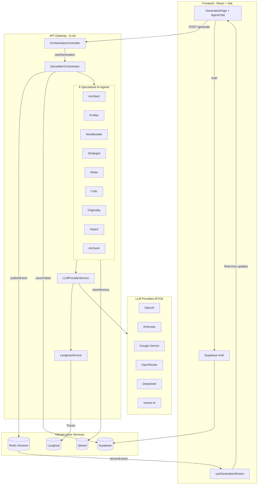
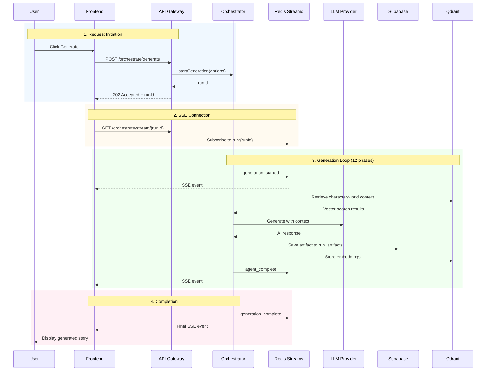
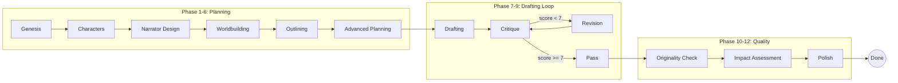
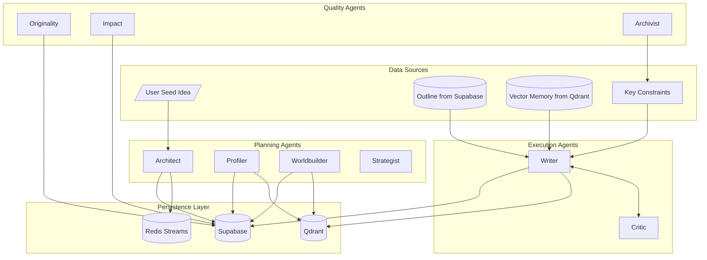
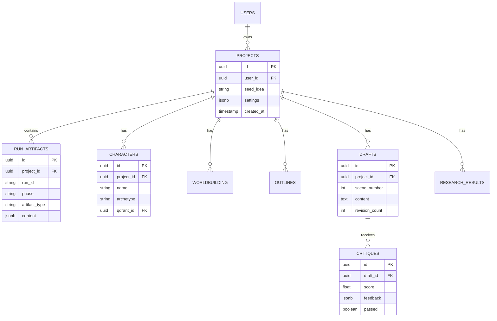
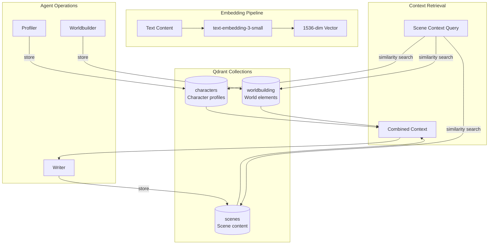
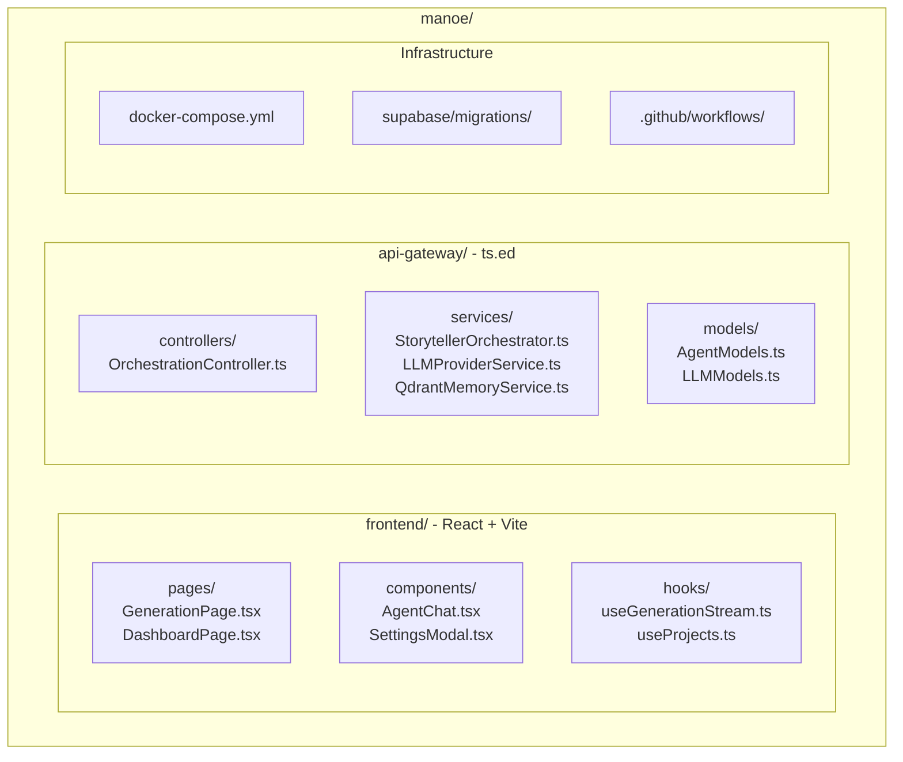
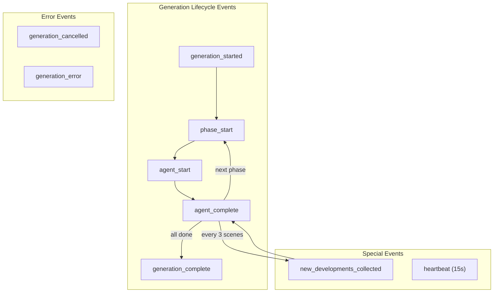
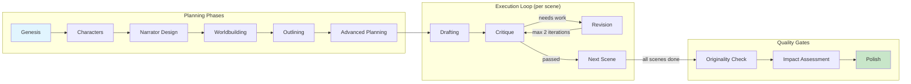

# MANOE - Multi-Agent Narrative Orchestration Engine

A scalable, event-driven platform designed to automate the creation of exceptional narratives by strictly adhering to proven storytelling principles from the "Storyteller" framework. MANOE uses a multi-agent architecture where specialized AI agents collaborate in real-time to generate compelling stories.

## Live Demo

- **Frontend**: https://manoe.iliashalkin.com
- **API Gateway (ts.ed)**: https://manoe-gateway.iliashalkin.com
- **Langfuse Dashboard**: https://langfuse.iliashalkin.com

## System Architecture

MANOE is a distributed system with a React frontend, TypeScript orchestrator (ts.ed), and multiple infrastructure services. The architecture follows an event-driven pattern where the orchestrator publishes events to Redis Streams, and the frontend subscribes via Server-Sent Events (SSE) for real-time updates.



## Detailed Architecture Diagrams

### Request Lifecycle

This sequence diagram shows the complete flow from when a user clicks "Generate" to receiving real-time updates:



### Generation Workflow State Machine

MANOE implements a 12-phase generation workflow with revision loops and quality gates:



**Workflow Details:**
- **Planning (6 phases)**: Architect creates narrative possibility, Profiler builds characters, Worldbuilder creates setting, Strategist plans scenes
- **Drafting Loop**: Writer drafts scene → Critic scores (threshold 7/10) → Revision if needed (max 2 iterations)
- **Archivist**: Runs every 3 scenes to update Key Constraints, track world state changes (character status, locations, timeline events), and prevent context drift
- **Quality Gates**: Originality check (plagiarism), Impact assessment (emotional resonance), Polish (final refinement)

### Agent System & Data Dependencies

Each of the 9 agents has specific data inputs and outputs:



**Agent Responsibilities:**

| Agent | Phase | Input | Output |
|-------|-------|-------|--------|
| Architect | Genesis, Outlining | Seed idea | Narrative possibility, Scene outline |
| Profiler | Characters | Seed idea | Character profiles + embeddings |
| Worldbuilder | Worldbuilding | Characters | World elements + embeddings |
| Strategist | Advanced Planning | Outline | Detailed scene plans |
| Writer | Drafting, Revision | Outline, Context, Constraints | Scene drafts + embeddings |
| Critic | Critique | Draft | Score (1-10) + feedback |
| Originality | Originality Check | Full draft | Plagiarism score |
| Impact | Impact Assessment | Full draft | Emotional resonance score |
| Archivist | Every 3 scenes | Raw facts | Updated Key Constraints |

### Data Model / Persistence



**Key Tables:**
- `projects` - User projects with seed idea and generation settings
- `run_artifacts` - All phase outputs (JSONB content for flexibility)
- `characters` / `worldbuilding` / `drafts` - Linked to Qdrant via `qdrant_id` for vector memory sync
- `critiques` - Quality scores and revision feedback
- `research_results` - "Eternal Memory" for cross-project reuse

### Qdrant Vector Collections



**Vector Memory Features:**
- **Embedding Model**: OpenAI text-embedding-3-small (1536 dimensions)
- **Similarity Search**: Cosine similarity for context retrieval
- **Cross-Collection Queries**: Writer retrieves from all 3 collections for scene context
- **Eternal Memory**: Embeddings persist across generation runs for continuity

### Repository Structure Map



**Key Files:**

| File | Lines | Description |
|------|-------|-------------|
| `frontend/src/components/AgentChat.tsx` | 2534 | Agent cards with real-time updates |
| `api-gateway/src/services/StorytellerOrchestrator.ts` | 1435 | Main orchestration logic |
| `api-gateway/src/models/AgentModels.ts` | - | 9 agents, 12 phases definitions |
| `api-gateway/src/models/LLMModels.ts` | - | 6 LLM provider configurations |

### SSE Event Types

The orchestrator publishes events to Redis Streams for real-time frontend updates via Server-Sent Events:



**Event Payload Structure:**

| Event | Key Fields | Description |
|-------|-----------|-------------|
| `generation_started` | runId, projectId | Run initialized |
| `phase_start` | phase, phaseNumber | New phase beginning |
| `agent_start` | agentName, phase | Agent activated |
| `agent_complete` | agentName, output | Agent output ready |
| `new_developments_collected` | constraints | Archivist update |
| `generation_complete` | totalPhases, duration | All phases done |
| `heartbeat` | timestamp | Keep-alive (15s interval) |

## Generation Workflow

MANOE implements a **12-phase narrative generation workflow** with revision loops and quality gates:



The workflow is orchestrated by `StorytellerOrchestrator.ts` (1435 lines) which manages phase transitions, revision loops, and the Archivist agent that runs every 3 scenes to update Key Constraints for continuity.

### Phase 1: Genesis
The Genesis agent accepts a "Seed Idea" from the user (What If? questions, image prompts) and configures the "Moral Compass" (Ethical, Unethical, Amoral, Ambiguous). It generates a structured "Narrative Possibility" JSON that defines the story's foundation, including plot summary, setting, main conflict, and thematic elements.

### Phase 2: Characters (Profiler Agent)
The Profiler assigns archetypes (Hero, Shadow, Trickster) to characters and generates "Core Psychological Wound" and "Inner Trap" for protagonists. Character attributes are stored as vectors in Qdrant for consistency across the narrative.

### Phase 2.5: Narrator Design
The Narrator Design phase generates the narrative voice configuration including POV type (first person, third person limited/omniscient), tense, voice characteristics, and style guidelines. This artifact is used by the Writer agent during the Drafting phase to maintain consistent narrative voice.

### Phase 3: Worldbuilding
The Worldbuilder creates detailed world elements including locations, cultures, rules, and atmosphere. These elements are stored in Qdrant vector memory for retrieval during scene writing.

### Phase 4: Outlining (Architect Agent)
The Architect maps the plot onto "Mythic Structure" (Hero's Journey, Three-Act Structure) and creates a scene-by-scene outline with conflict, emotional beats, and subtext.

### Phase 5: Advanced Planning
Generates detailed planning artifacts including contradiction maps, emotional beat sheets, sensory blueprints, subtext design, and complexity checklists to ensure narrative coherence.

### Phase 6: Drafting (Writer Agent)
The Writer drafts scenes using "Show, Don't Tell" principles. Each scene is written with full context from Qdrant memory including relevant characters, worldbuilding elements, and previous scenes for continuity.

### Phase 7: Polish (Editor Agent)
The Editor refines the draft with iterative quality checks, validating pacing, originality, dialogue, and subtext. This phase involves up to 2 revision rounds per scene until quality standards are met.

## Key Features

### Selective Regeneration

MANOE supports two types of selective regeneration for iterative refinement:

**Phase-Based Regeneration**: Edit any agent's output and regenerate from that phase onwards. Previous phases are preserved using stored artifacts from Supabase. Use the "What did you change?" field to pass instructions to the AI about your modifications.

**Scene-Level Regeneration**: Select specific scenes to regenerate via the Writer agent's modal UI. The system maintains continuity between old and new scenes using Qdrant memory context.

### Memory Context System

The system uses Qdrant vector database to maintain narrative consistency:

- **Character Memory**: Character profiles are embedded and retrieved based on scene relevance
- **Worldbuilding Memory**: World elements are stored and retrieved for consistent world details
- **Scene Memory**: Previous scenes are embedded for continuity in subsequent scenes

### World State Tracking

MANOE maintains a dynamic world state that tracks changes throughout the narrative generation process. This ensures consistency in character status, locations, and timeline events across scenes.

**World State Components:**
- **Character Updates**: Tracks character status (alive, dead, unknown, transformed), current location, and new attributes discovered during the story
- **New Locations**: Records new locations introduced in scenes with type and description
- **Timeline Events**: Logs significant events with their narrative importance (major, minor, background)

**How It Works:**
1. World state is initialized after the Characters phase using character profiles
2. The Archivist agent runs every 3 scenes and outputs a `worldStateDiff` with changes
3. Diffs are applied to the world state, maintaining a consistent view of the story world
4. The world state is available to agents for context during drafting and revision

### Artifact Persistence

All generation artifacts are stored in Supabase for resuming interrupted generations, phase-based selective regeneration, scene-level selective regeneration, and project history/versioning. Characters, drafts, and critiques are also persisted to normalized database tables for efficient querying and cross-project analysis.

### Marketing Research Integration

MANOE includes an optional **Marketing Researcher** feature that uses AI-powered deep research to analyze your target audience before generation begins. This helps create more targeted and resonant narratives.

**Supported Research Providers:**
- **Perplexity** (sonar-deep-research model) - Fast, comprehensive web research
- **OpenAI Deep Research** (Responses API with background mode) - In-depth analysis taking 5-15 minutes

**Features:**
- **BYOK (Bring Your Own Key)** - Add your Perplexity or OpenAI API key in Settings > Research
- **Eternal Memory** - Research results are stored in Supabase and vectorized in Qdrant for reuse across projects
- **Semantic Similarity Search** - Before conducting new research, the system checks for similar existing research (>50% similarity threshold) to save costs
- **Prompt Context Injection** - Research insights are automatically injected into Genesis and Characters agent prompts

**How to Use:**
1. Add your Perplexity or OpenAI API key in Settings > Research tab
2. On the project creation page, click the "Research" button next to Target Audience
3. Select your preferred provider and click "Start Research"
4. View research history in Settings > Research History

### LLM Observability (Langfuse)

MANOE includes self-hosted **Langfuse** for complete LLM observability:

- **Langfuse Dashboard**: https://langfuse.iliashalkin.com
- **Trace Visualization**: See the full trace tree for each generation run
- **Token Usage Tracking**: Monitor input/output tokens per agent call
- **Latency Metrics**: Track response times across different LLM providers
- **Error Debugging**: Inspect failed LLM calls with full request/response data

**Langfuse Prompt Management:**

MANOE uses Langfuse Prompt Management for versioned prompts with production labels:
- `manoe-architect-v1` - Story structure and narrative design
- `manoe-profiler-v1` - Character creation and psychology
- `manoe-worldbuilder-v1` - Setting and world details
- `manoe-writer-v1` - Prose generation
- `manoe-critic-v1` - Quality evaluation and feedback

**Model Selection Architecture:**

The model used for generation is determined by the following precedence:
1. **Request `llmConfig.model`** - User's selection from frontend settings (highest priority)
2. **Environment variable** - Server-side default (e.g., `OPENAI_API_KEY` enables OpenAI)
3. **`DEFAULT_MODELS`** - Code defaults in `LLMModels.ts` (gpt-5.2 for OpenAI)

The `config.model` field in Langfuse prompts is metadata/documentation only - it does not override the user's model selection. Langfuse tracing shows the actual model used in each generation, not the prompt's config.model.

**Self-Hosted Stack:**
| Service | Description |
|---------|-------------|
| langfuse-web | Web UI and API (Next.js) |
| langfuse-worker | Background job processor |
| langfuse-postgres | PostgreSQL database |
| langfuse-clickhouse | Analytics database |
| langfuse-redis | Caching and queues |
| langfuse-minio | S3-compatible blob storage |

Tracing is automatically enabled when `LANGFUSE_PUBLIC_KEY` and `LANGFUSE_SECRET_KEY` are configured in the orchestrator environment.

### LLM-as-a-Judge Evaluation

MANOE includes automatic quality evaluation using LLM-as-a-Judge methodology. The EvaluationService runs lightweight evaluations to score generation quality without manual review.

**Evaluation Types:**
- **Faithfulness**: Measures how well Writer output matches the Architect's plan (score 0-1)
- **Relevance**: Measures how well Profiler character output matches the user's seed idea (score 0-1)

**Features:**
- Uses cost-effective models (default: gpt-4o-mini) for evaluations
- Records scores in both Langfuse (for tracing) and Prometheus (for dashboards)
- Configurable via environment variables: `EVALUATION_LLM_PROVIDER`, `EVALUATION_LLM_MODEL`, `EVALUATION_LLM_API_KEY`

**Metrics:**
| Metric | Type | Description |
|--------|------|-------------|
| `manoe_evaluation_score` | Gauge | LLM-as-a-Judge evaluation scores by type and agent |
| `manoe_evaluation_calls_total` | Counter | Total evaluation calls by type, status |
| `manoe_evaluation_duration_seconds` | Histogram | Evaluation latency |

### Prometheus Metrics & Grafana Dashboards

MANOE includes comprehensive Prometheus metrics for production monitoring:

**Metrics Endpoint**: `GET /api/metrics` - Prometheus-compatible metrics endpoint

**Available Metrics:**

| Metric | Type | Description |
|--------|------|-------------|
| `manoe_agent_executions_total` | Counter | Total agent executions by agent_name, status, error_type |
| `manoe_agent_execution_duration_seconds` | Histogram | Agent execution duration with p50/p95/p99 buckets |
| `manoe_llm_calls_total` | Counter | LLM API calls by provider, model, agent_name, status |
| `manoe_llm_call_duration_seconds` | Histogram | LLM call latency |
| `manoe_llm_tokens_total` | Counter | Token usage by provider, model, token_type (prompt/completion) |
| `manoe_llm_cost_total` | Counter | LLM cost in USD by provider, model, agent_name, run_id |
| `manoe_db_queries_total` | Counter | Database queries by operation (select/insert), table, status |
| `manoe_qdrant_operations_total` | Counter | Qdrant operations by operation (upsert/search), collection, status |
| `manoe_redis_stream_length` | Gauge | Current length of Redis streams |
| `manoe_redis_consumer_lag` | Gauge | Redis consumer group lag (messages behind) |
| `manoe_user_feedback_total` | Counter | User feedback by feedback_type (thumbs_up/thumbs_down), agent_name |
| `manoe_regeneration_requests_total` | Counter | Regeneration requests (implicit negative feedback) |

**Grafana Dashboard**: The `monitoring/grafana/dashboards/manoe-agents.json` provides a pre-built dashboard with 8 panels covering agent success rates, latency, LLM costs, token usage, Redis lag, and user feedback.

**Alert Rules**: The `monitoring/alerts.yml` defines Prometheus alerting rules:
- `AgentSuccessRateLow` - Agent success rate below 90%
- `AgentLatencyHigh` - p95 latency above 45 seconds
- `AgentLatencyCritical` - p95 latency above 60 seconds
- `RedisStreamsLagHigh` - Consumer lag above 1000 messages
- `LLMRateLimitErrors` - Rate limit errors detected
- `HighTokenCost` - Hourly cost exceeds threshold
- `HighRegenerationRate` - High regeneration rate (implicit negative feedback)
- `LowUserSatisfaction` - Low thumbs up ratio

**User Feedback Integration**: The frontend includes `FeedbackButtons` component for explicit user feedback (thumbs up/down) on agent outputs. Feedback is recorded in both Langfuse (for quality scoring) and Prometheus metrics.

### State Recovery & Retry Mechanism

MANOE includes robust error handling for long-running generations:

- **Automatic Retry** - Transient errors (429 rate limits, 5xx server errors, timeouts) are automatically retried with exponential backoff (up to 3 attempts)
- **Phase Checkpointing** - Each completed phase is saved to Supabase, allowing resume from the last successful phase
- **Graceful Interruption Handling** - If the orchestrator restarts during generation, the frontend receives a clear error message with resume information instead of hanging

### Multi-Provider LLM Support (BYOK)

MANOE supports multiple LLM providers with BYOK (Bring Your Own Key). Configure at least one provider to get started.

## Quick Start with Docker

The fastest way to get started is using Docker Compose:

```bash
# Clone the repository
git clone https://github.com/IShalkin/manoe.git
cd manoe

# Configure your API keys
cp .env.example .env
# Edit .env with your API keys (at least one LLM provider required)

# Start all services
docker-compose up -d

# Access the frontend at http://localhost:5173
# Access the API gateway at http://localhost:3000
```

### Docker Services

The docker-compose.yml includes the following services:

| Service | Internal Port | Description |
|---------|---------------|-------------|
| **frontend** | 5173 | React + TypeScript + Vite web interface |
| **api-gateway** | 3000 | TypeScript/Ts.ED API gateway with SSE |
| **redis** | 6379 | Message broker for real-time SSE events |
| **qdrant** | 6333 | Vector database for character/worldbuilding memory |
| **langfuse-web** | 3000 | Langfuse observability UI (separate subdomain) |

> **Note:** Ports shown are internal container ports. In production, services are accessed via nginx-proxy with separate subdomains (e.g., `manoe.iliashalkin.com`, `langfuse.iliashalkin.com`).

### Environment Variables for Docker

Create a `.env` file in the root directory with your API keys:

```env
# Required: At least one LLM provider
OPENAI_API_KEY=your-openai-key
# Or use other providers:
# ANTHROPIC_API_KEY=your-anthropic-key
# GEMINI_API_KEY=your-gemini-key
# VENICE_API_KEY=your-venice-key

# Optional: Supabase for persistence
VITE_SUPABASE_URL=your-supabase-url
VITE_SUPABASE_ANON_KEY=your-supabase-anon-key
```

### Supported LLM Providers

MANOE supports multiple LLM providers with BYOK (Bring Your Own Key):

| Provider | Models | Best For |
|----------|--------|----------|
| **OpenAI** | GPT-4o, GPT-4o-mini, o1, o3 | Reasoning, general purpose |
| **Google Gemini** | Gemini 2.0 Flash, Gemini 1.5 Pro | Long context, complex logic |
| **Anthropic Claude** | Claude 3.5 Sonnet, Claude 3 Haiku | Creative writing, prose quality |
| **OpenRouter** | Access to multiple providers via single API | Cost optimization, model variety |

### Moral Compass Framework

Generate narratives through different ethical lenses:
- **Ethical**: Traditional hero's journey with clear moral lessons
- **Unethical**: Villain protagonists, morally dark narratives
- **Amoral**: Neutral perspective without moral judgment
- **Ambiguous**: Complex moral situations without clear answers

## Project Structure

```
manoe/
├── frontend/                    # React + TypeScript + Vite Frontend
│   ├── src/
│   │   ├── components/          # UI components
│   │   │   ├── AgentChat.tsx    # Agent cards and regeneration modals
│   │   │   ├── Layout.tsx       # App layout
│   │   │   └── SettingsModal.tsx
│   │   ├── contexts/            # React contexts (Auth, Settings)
│   │   ├── hooks/               # Custom hooks (useProjects, useSettings)
│   │   ├── pages/
│   │   │   ├── GenerationPage.tsx  # Main generation UI
│   │   │   ├── DashboardPage.tsx
│   │   │   └── ...
│   │   └── lib/                 # Utilities and Supabase client
│   └── package.json
├── api-gateway/                 # TypeScript ts.ed API Gateway
│   ├── src/
│   │   ├── controllers/         # ts.ed controllers with Swagger decorators
│   │   │   └── OrchestrationController.ts  # Generation endpoints
│   │   ├── services/            # Business logic services
│   │   │   ├── LLMProviderService.ts       # Multi-provider LLM client (BYOK)
│   │   │   ├── StorytellerOrchestrator.ts  # Multi-agent orchestration engine
│   │   │   ├── LangfuseService.ts          # Tracing + Prompt Management
│   │   │   ├── RedisStreamsService.ts      # SSE event streaming
│   │   │   ├── QdrantMemoryService.ts      # Vector memory
│   │   │   └── SupabaseService.ts          # Artifact persistence
│   │   ├── models/              # DTOs and type definitions
│   │   │   ├── LLMModels.ts     # LLM provider types and defaults
│   │   │   └── AgentModels.ts   # Agent types and phase configs
│   │   └── Server.ts            # ts.ed server configuration
│   └── package.json
├── supabase/                    # Supabase configuration and migrations
├── docs/                        # Documentation
├── docker-compose.yml           # Docker Compose for local development
└── docker-compose.vps.yml       # Docker Compose for VPS deployment
```

## Supabase Schema

The following tables are used for persistence:

| Table | Description |
|-------|-------------|
| **projects** | User projects with seed_idea, settings, moral_compass |
| **run_artifacts** | Phase artifacts (project_id UUID FK, run_id, phase, artifact_type, content JSONB) |
| **research_results** | Marketing research results with prompt_context for AI injection, citations, and Qdrant point_id for semantic search |
| **characters** | Generated character profiles |
| **worldbuilding** | World elements and settings |
| **outlines** | Plot outlines with scene breakdowns |
| **drafts** | Scene drafts with narrative content |
| **critiques** | Editor feedback and quality scores |

## API Endpoints

### API Gateway Endpoints

| Endpoint | Method | Description |
|----------|--------|-------------|
| `/api/health` | GET | Health check |
| `/orchestrate/generate` | POST | Start multi-agent generation |
| `/orchestrate/stream/{run_id}` | GET | SSE stream for real-time events |
| `/orchestrate/runs/{run_id}/events` | GET | SSE stream (legacy route) |
| `/orchestrate/runs/{run_id}/state` | GET | Get run state for recovery |
| `/orchestrate/runs/{run_id}/cancel` | POST | Cancel a running generation |
| `/api/research` | POST | Conduct market research |
| `/api/research/history` | GET | Get user's research history |

### Generate Request Body

```json
{
  "seed_idea": "What if a detective could see the last 10 seconds of a murder victim's life?",
  "moral_compass": "ambiguous",
  "target_audience": "Adult thriller readers",
  "themes": "justice,memory,truth",
  "provider": "openai",
  "model": "gpt-4o",
  "api_key": "your-api-key",
  "supabase_project_id": "uuid-of-project",
  "start_from_phase": "characters",
  "previous_run_id": "uuid-of-previous-run",
  "scenes_to_regenerate": [2, 5],
  "constraints": {
    "edit_comment": "Make the protagonist more conflicted about their abilities"
  }
}
```

## Environment Variables

### Frontend
- `VITE_SUPABASE_URL` - Supabase project URL
- `VITE_SUPABASE_ANON_KEY` - Supabase anonymous key
- `VITE_ORCHESTRATOR_URL` - Orchestrator API URL

### API Gateway
- `REDIS_URL` - Redis connection URL
- `SUPABASE_URL` - Supabase project URL
- `SUPABASE_KEY` - Supabase service key (required for artifact persistence)
- `QDRANT_URL` - Qdrant server URL (required for memory context features)
- `QDRANT_API_KEY` - Qdrant API key (if authentication enabled)
- `LANGFUSE_PUBLIC_KEY` - Langfuse public key (enables tracing)
- `LANGFUSE_SECRET_KEY` - Langfuse secret key (enables tracing)
- `LANGFUSE_HOST` - Langfuse host URL (default: http://langfuse-web:3000 for self-hosted)
- `OPENAI_API_KEY` - OpenAI API key (optional, for embeddings and generation)
- `ANTHROPIC_API_KEY` - Anthropic API key (optional)
- `GEMINI_API_KEY` - Google Gemini API key (optional)

## Development Setup

### Frontend

```bash
cd frontend
npm install
cp .env.example .env
# Configure environment variables
npm run dev
```

### API Gateway (ts.ed)

```bash
cd api-gateway
npm install
cp .env.example .env
# Configure environment variables
npm run dev
```

## Deployment

For VPS deployment, use the provided `docker-compose.vps.yml`:

```bash
# On your VPS
docker compose -f docker-compose.vps.yml up -d
```

The VPS configuration includes nginx-proxy integration for automatic SSL certificates via Let's Encrypt.

**For detailed deployment instructions**, including Qdrant ulimits configuration, Langfuse internal networking, Supabase RLS setup, and troubleshooting common issues, see [docs/DEPLOYMENT.md](docs/DEPLOYMENT.md).

## Success Metrics

The system aims for high-quality narrative output measured by structural adherence (100% of scenes match the generated outline), psychological depth (every protagonist has defined "Inner Trap" and "Breaking Point"), and sensory density (every scene contains at least 3 distinct sensory details).

## License

This project is licensed under the **Creative Commons Attribution-NonCommercial-ShareAlike 4.0 International License (CC BY-NC-SA 4.0)**.

You are free to share and adapt this work for non-commercial purposes, provided you give appropriate credit and distribute any derivative works under the same license.

**Citation:**
```
Shalkin, I. (2025). MANOE: Multi-Agent Narrative Orchestration Engine. 
GitHub. https://github.com/IShalkin/manoe
```

For commercial licensing inquiries, contact: mailtoshalkin@gmail.com

See [LICENSE](LICENSE) for full details.

## Contributing

Contributions are welcome! Please read the contributing guidelines before submitting PRs.
