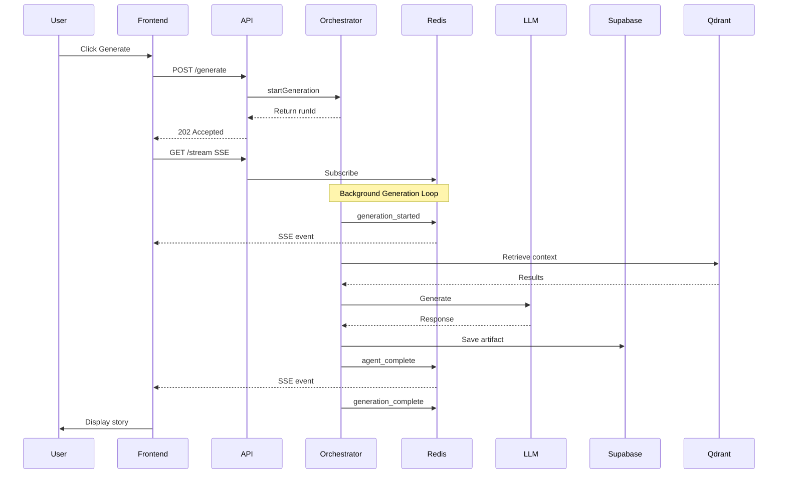
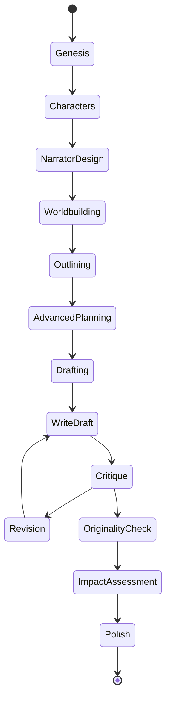
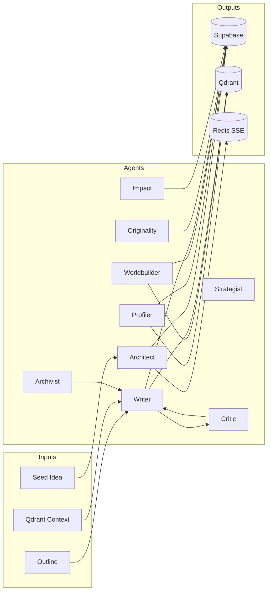
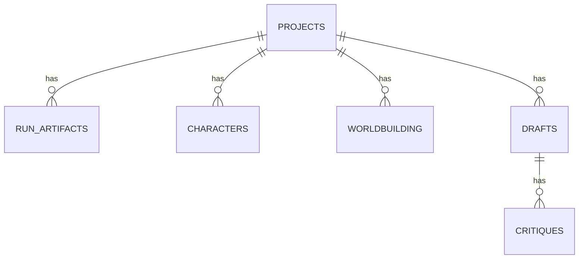
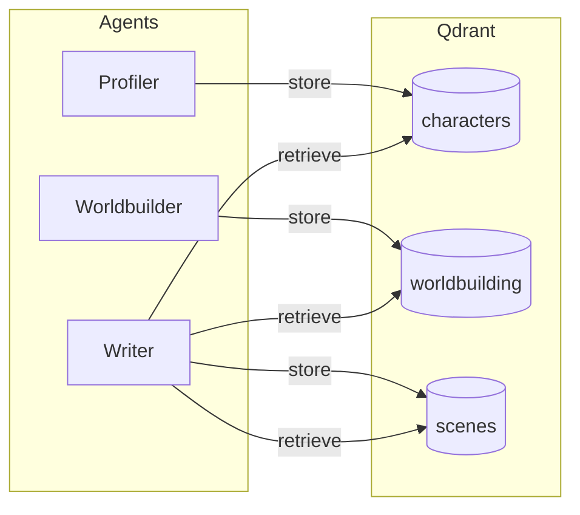
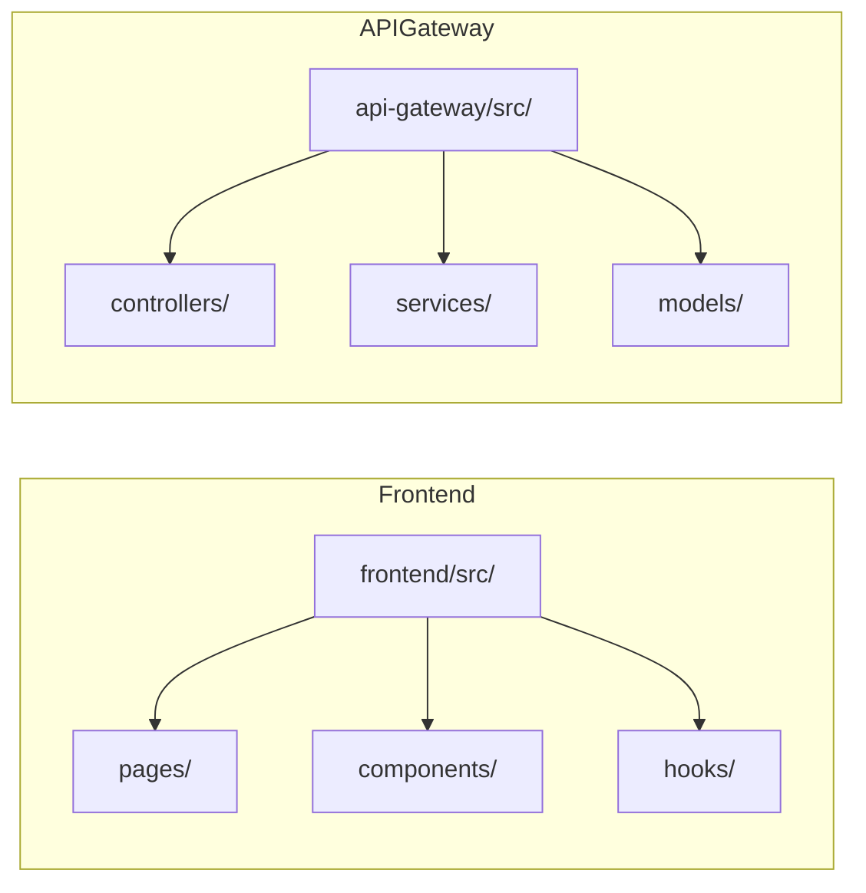

# MANOE - Multi-Agent Narrative Orchestration Engine

A scalable, event-driven platform designed to automate the creation of exceptional narratives by strictly adhering to proven storytelling principles from the "Storyteller" framework. MANOE uses a multi-agent architecture where specialized AI agents collaborate in real-time to generate compelling stories.

## Live Demo

- **Frontend**: https://manoe.iliashalkin.com
- **API Gateway (ts.ed)**: https://manoe-gateway.iliashalkin.com
- **Orchestrator API**: https://manoe-orchestrator.iliashalkin.com
- **Langfuse Dashboard**: https://langfuse.iliashalkin.com

## System Architecture

MANOE is a distributed system with a React frontend, TypeScript orchestrator (ts.ed), and multiple infrastructure services. The architecture follows an event-driven pattern where the orchestrator publishes events to Redis Streams, and the frontend subscribes via Server-Sent Events (SSE) for real-time updates.


<details>
<summary><strong>📊 Detailed Architecture Diagrams</strong> (click to expand)</summary>

### Request Lifecycle

This sequence diagram shows the complete flow from when a user clicks "Generate" to receiving real-time updates:



### Generation Workflow State Machine

MANOE implements a 12-phase generation workflow with revision loops and quality gates:



**Workflow Details:**
- **Genesis → AdvancedPlanning**: Planning phases (Architect, Profiler, Worldbuilder, Strategist agents)
- **Drafting Loop**: Writer → Critic → Revision cycle (max 2 iterations, quality threshold 7/10)
- **Archivist**: Runs every 3 scenes to update Key Constraints and prevent context drift
- **Quality Gates**: Originality check, Impact assessment, Polish

### Agent System & Data Dependencies

Each of the 9 agents has specific data inputs and outputs:



**Agent Responsibilities:**
- **Planning**: Architect (Genesis, Outlining), Profiler (Characters), Worldbuilder, Strategist (Advanced Planning)
- **Execution**: Writer (Drafting, Revision), Critic (Quality feedback)
- **Quality**: Originality (Plagiarism check), Impact (Emotional assessment), Archivist (Key Constraints)

### Data Model / Persistence



**Supabase Tables:**
| Table | Key Fields |
|-------|-----------|
| `projects` | id, user_id, seed_idea, settings |
| `run_artifacts` | project_id, run_id, phase, artifact_type, content |
| `characters` | project_id, name, archetype, psychology, qdrant_point_id |
| `worldbuilding` | project_id, element_type, content, qdrant_point_id |
| `drafts` | project_id, scene_number, content, revision_count |
| `critiques` | draft_id, score, feedback, passed |
| `research_results` | project_id, provider, query, result, citations |

### Qdrant Vector Collections



All collections use 1536-dimensional vectors (OpenAI text-embedding-3-small).

### Repository Structure Map



**Key Files:**
- `frontend/src/pages/GenerationPage.tsx` - Main generation UI
- `frontend/src/components/AgentChat.tsx` - Agent cards (2534 lines)
- `frontend/src/hooks/useGenerationStream.ts` - SSE streaming hook
- `api-gateway/src/services/StorytellerOrchestrator.ts` - Main orchestrator (1435 lines)
- `api-gateway/src/models/AgentModels.ts` - 9 agents, 12 phases
- `api-gateway/src/models/LLMModels.ts` - 6 LLM providers

### SSE Event Types

The orchestrator publishes these event types to Redis Streams for real-time frontend updates:


**Event Descriptions:**
- `generation_started` - Run initialized with runId
- `phase_start` - New phase beginning
- `agent_start` - Agent activated
- `agent_complete` - Agent output ready
- `new_developments_collected` - Archivist constraint update
- `generation_complete` - All phases done
- `generation_cancelled` - User cancelled
- `generation_error` - Fatal error
- `heartbeat` - Keep-alive every 15s

</details>

## Generation Workflow

MANOE implements a **12-phase narrative generation workflow** with revision loops and quality gates:


The workflow is orchestrated by `StorytellerOrchestrator.ts` (1435 lines) which manages phase transitions, revision loops, and the Archivist agent that runs every 3 scenes to update Key Constraints for continuity.

### Phase 1: Genesis
The Genesis agent accepts a "Seed Idea" from the user (What If? questions, image prompts) and configures the "Moral Compass" (Ethical, Unethical, Amoral, Ambiguous). It generates a structured "Narrative Possibility" JSON that defines the story's foundation, including plot summary, setting, main conflict, and thematic elements.

### Phase 2: Characters (Profiler Agent)
The Profiler assigns archetypes (Hero, Shadow, Trickster) to characters and generates "Core Psychological Wound" and "Inner Trap" for protagonists. Character attributes are stored as vectors in Qdrant for consistency across the narrative.

### Phase 2.5: Narrator Design
The Narrator Design phase generates the narrative voice configuration including POV type (first person, third person limited/omniscient), tense, voice characteristics, and style guidelines. This artifact is used by the Writer agent during the Drafting phase to maintain consistent narrative voice.

### Phase 3: Worldbuilding
The Worldbuilder creates detailed world elements including locations, cultures, rules, and atmosphere. These elements are stored in Qdrant vector memory for retrieval during scene writing.

### Phase 4: Outlining (Architect Agent)
The Architect maps the plot onto "Mythic Structure" (Hero's Journey, Three-Act Structure) and creates a scene-by-scene outline with conflict, emotional beats, and subtext.

### Phase 5: Advanced Planning
Generates detailed planning artifacts including contradiction maps, emotional beat sheets, sensory blueprints, subtext design, and complexity checklists to ensure narrative coherence.

### Phase 6: Drafting (Writer Agent)
The Writer drafts scenes using "Show, Don't Tell" principles. Each scene is written with full context from Qdrant memory including relevant characters, worldbuilding elements, and previous scenes for continuity.

### Phase 7: Polish (Editor Agent)
The Editor refines the draft with iterative quality checks, validating pacing, originality, dialogue, and subtext. This phase involves up to 2 revision rounds per scene until quality standards are met.

## Key Features

### Selective Regeneration

MANOE supports two types of selective regeneration for iterative refinement:

**Phase-Based Regeneration**: Edit any agent's output and regenerate from that phase onwards. Previous phases are preserved using stored artifacts from Supabase. Use the "What did you change?" field to pass instructions to the AI about your modifications.

**Scene-Level Regeneration**: Select specific scenes to regenerate via the Writer agent's modal UI. The system maintains continuity between old and new scenes using Qdrant memory context.

### Memory Context System

The system uses Qdrant vector database to maintain narrative consistency:

- **Character Memory**: Character profiles are embedded and retrieved based on scene relevance
- **Worldbuilding Memory**: World elements are stored and retrieved for consistent world details
- **Scene Memory**: Previous scenes are embedded for continuity in subsequent scenes

### Artifact Persistence

All generation artifacts are stored in Supabase for resuming interrupted generations, phase-based selective regeneration, scene-level selective regeneration, and project history/versioning.

### Marketing Research Integration

MANOE includes an optional **Marketing Researcher** feature that uses AI-powered deep research to analyze your target audience before generation begins. This helps create more targeted and resonant narratives.

**Supported Research Providers:**
- **Perplexity** (sonar-deep-research model) - Fast, comprehensive web research
- **OpenAI Deep Research** (Responses API with background mode) - In-depth analysis taking 5-15 minutes

**Features:**
- **BYOK (Bring Your Own Key)** - Add your Perplexity or OpenAI API key in Settings > Research
- **Eternal Memory** - Research results are stored in Supabase and vectorized in Qdrant for reuse across projects
- **Semantic Similarity Search** - Before conducting new research, the system checks for similar existing research (>50% similarity threshold) to save costs
- **Prompt Context Injection** - Research insights are automatically injected into Genesis and Characters agent prompts

**How to Use:**
1. Add your Perplexity or OpenAI API key in Settings > Research tab
2. On the project creation page, click the "Research" button next to Target Audience
3. Select your preferred provider and click "Start Research"
4. View research history in Settings > Research History

### LLM Observability (Langfuse)

MANOE includes self-hosted **Langfuse** for complete LLM observability:

- **Langfuse Dashboard**: https://langfuse.iliashalkin.com
- **Trace Visualization**: See the full trace tree for each generation run
- **Token Usage Tracking**: Monitor input/output tokens per agent call
- **Latency Metrics**: Track response times across different LLM providers
- **Error Debugging**: Inspect failed LLM calls with full request/response data

**Langfuse Prompt Management:**

MANOE uses Langfuse Prompt Management for versioned prompts with production labels:
- `manoe-architect-v1` - Story structure and narrative design
- `manoe-profiler-v1` - Character creation and psychology
- `manoe-worldbuilder-v1` - Setting and world details
- `manoe-writer-v1` - Prose generation
- `manoe-critic-v1` - Quality evaluation and feedback

**Model Selection Architecture:**

The model used for generation is determined by the following precedence:
1. **Request `llmConfig.model`** - User's selection from frontend settings (highest priority)
2. **Environment variable** - Server-side default (e.g., `OPENAI_API_KEY` enables OpenAI)
3. **`DEFAULT_MODELS`** - Code defaults in `LLMModels.ts` (gpt-5.2 for OpenAI)

The `config.model` field in Langfuse prompts is metadata/documentation only - it does not override the user's model selection. Langfuse tracing shows the actual model used in each generation, not the prompt's config.model.

**Self-Hosted Stack:**
| Service | Description |
|---------|-------------|
| langfuse-web | Web UI and API (Next.js) |
| langfuse-worker | Background job processor |
| langfuse-postgres | PostgreSQL database |
| langfuse-clickhouse | Analytics database |
| langfuse-redis | Caching and queues |
| langfuse-minio | S3-compatible blob storage |

Tracing is automatically enabled when `LANGFUSE_PUBLIC_KEY` and `LANGFUSE_SECRET_KEY` are configured in the orchestrator environment.

### State Recovery & Retry Mechanism

MANOE includes robust error handling for long-running generations:

- **Automatic Retry** - Transient errors (429 rate limits, 5xx server errors, timeouts) are automatically retried with exponential backoff (up to 3 attempts)
- **Phase Checkpointing** - Each completed phase is saved to Supabase, allowing resume from the last successful phase
- **Graceful Interruption Handling** - If the orchestrator restarts during generation, the frontend receives a clear error message with resume information instead of hanging

### Multi-Provider LLM Support (BYOK)

MANOE supports multiple LLM providers with BYOK (Bring Your Own Key). Configure at least one provider to get started.

## Quick Start with Docker

The fastest way to get started is using Docker Compose:

```bash
# Clone the repository
git clone https://github.com/IShalkin/manoe.git
cd manoe

# Configure your API keys
cp .env.example .env
# Edit .env with your API keys (at least one LLM provider required)

# Start all services
docker-compose up -d

# Access the frontend at http://localhost:5173
# Access the orchestrator API at http://localhost:8001
```

### Docker Services

The docker-compose.yml includes the following services:

| Service | Port | Description |
|---------|------|-------------|
| **frontend** | 5173 | React + TypeScript + Vite web interface |
| **orchestrator** | 8001 | Python FastAPI AI orchestrator with SSE |
| **redis** | 6379 | Message broker for real-time SSE events |
| **qdrant** | 6333 | Vector database for character/worldbuilding memory |
| **langfuse-web** | 3000 | Langfuse observability UI and API |

### Environment Variables for Docker

Create a `.env` file in the root directory with your API keys:

```env
# Required: At least one LLM provider
OPENAI_API_KEY=your-openai-key
# Or use other providers:
# ANTHROPIC_API_KEY=your-anthropic-key
# GEMINI_API_KEY=your-gemini-key
# VENICE_API_KEY=your-venice-key

# Optional: Supabase for persistence
VITE_SUPABASE_URL=your-supabase-url
VITE_SUPABASE_ANON_KEY=your-supabase-anon-key
```

### Model Tiers (December 2025)

| Tier | Model | Release | Best For | Verdict |
|------|-------|---------|----------|---------|
| **S+ Logic** | Gemini 3 Pro | Nov 2025 | Complex plot logic | New king of AI. Google finally surpassed everyone. Deep Think integrated into core. Builds dynamic world model of your plot. |
| **S+ Prose** | Claude Opus 4.5 | Nov 2025 | Living prose, RP | Most human-like AI. Talented writer. Best for RP and literature. Many prefer it for style over technically stronger models. |
| **S+ Uncensored** | Dolphin Mistral 24B Venice | Apr 2025 | Dark plots, roleplay | Best uncensored model for creativity. No moralizing. Perfect for dark plots and political intrigue. |
| **A+ Context** | Llama 4 Maverick (Venice) | May 2025 | 256k context | 256k context with Venice jailbreak. 3x fewer refusals. Technically smarter than Dolphin. |
| **A** | GPT-5.2 | Dec 2025 | Fast logic | Improved routing (decides when to think deep vs fast). Less moralistic than 5.0. |

### Supported LLM Providers

| Provider | Top Models | Best For |
|----------|------------|----------|
| **OpenAI** | GPT-5.2, GPT-5, O3, GPT-4o | Reasoning, general purpose |
| **Google Gemini** | Gemini 3 Pro, Gemini 3 Flash, Gemini 2.0 Flash | Long context (2M tokens), complex logic |
| **Anthropic Claude** | Claude Opus 4.5, Claude Sonnet 4, Claude 3.5 Sonnet | Creative writing, prose quality |
| **Venice AI** | Dolphin Mistral 24B, Llama 4 Maverick, Qwen 3 235B | Uncensored content, dark themes |
| **DeepSeek** | DeepSeek V3, DeepSeek R1 | Cost-effective reasoning |
| **OpenRouter** | Access to all above via single API | Cost optimization, model variety |

### Moral Compass Framework

Generate narratives through different ethical lenses:
- **Ethical**: Traditional hero's journey with clear moral lessons
- **Unethical**: Villain protagonists, morally dark narratives
- **Amoral**: Neutral perspective without moral judgment
- **Ambiguous**: Complex moral situations without clear answers

## Project Structure

```
manoe/
├── frontend/                    # React + TypeScript + Vite Frontend
│   ├── src/
│   │   ├── components/          # UI components
│   │   │   ├── AgentChat.tsx    # Agent cards and regeneration modals
│   │   │   ├── Layout.tsx       # App layout
│   │   │   └── SettingsModal.tsx
│   │   ├── contexts/            # React contexts (Auth, Settings)
│   │   ├── hooks/               # Custom hooks (useProjects, useSettings)
│   │   ├── pages/
│   │   │   ├── GenerationPage.tsx  # Main generation UI
│   │   │   ├── DashboardPage.tsx
│   │   │   └── ...
│   │   └── lib/                 # Utilities and Supabase client
│   └── package.json
├── api-gateway/                 # TypeScript ts.ed API Gateway
│   ├── src/
│   │   ├── controllers/         # ts.ed controllers with Swagger decorators
│   │   │   └── OrchestrationController.ts  # Generation endpoints
│   │   ├── services/            # Business logic services
│   │   │   ├── LLMProviderService.ts       # Multi-provider LLM client (BYOK)
│   │   │   ├── StorytellerOrchestrator.ts  # Multi-agent orchestration engine
│   │   │   ├── LangfuseService.ts          # Tracing + Prompt Management
│   │   │   ├── RedisStreamsService.ts      # SSE event streaming
│   │   │   ├── QdrantMemoryService.ts      # Vector memory
│   │   │   └── SupabaseService.ts          # Artifact persistence
│   │   ├── models/              # DTOs and type definitions
│   │   │   ├── LLMModels.ts     # LLM provider types and defaults
│   │   │   └── AgentModels.ts   # Agent types and phase configs
│   │   └── Server.ts            # ts.ed server configuration
│   └── package.json
├── _legacy/                     # Archived legacy code (reference only)
│   ├── orchestrator/            # Python/FastAPI orchestrator (replaced by api-gateway)
│   └── backend/                 # Original Express.js backend
├── supabase/                    # Supabase configuration and migrations
├── docs/                        # Documentation
├── docker-compose.yml           # Docker Compose for local development
└── docker-compose.vps.yml       # Docker Compose for VPS deployment
```

## Supabase Schema

The following tables are used for persistence:

| Table | Description |
|-------|-------------|
| **projects** | User projects with seed_idea, settings, moral_compass |
| **run_artifacts** | Phase artifacts (project_id UUID FK, run_id, phase, artifact_type, content JSONB) |
| **research_results** | Marketing research results with prompt_context for AI injection, citations, and Qdrant point_id for semantic search |
| **characters** | Generated character profiles |
| **worldbuilding** | World elements and settings |
| **outlines** | Plot outlines with scene breakdowns |
| **drafts** | Scene drafts with narrative content |
| **critiques** | Editor feedback and quality scores |

## API Endpoints

### Orchestrator API (Port 8001)

| Endpoint | Method | Description |
|----------|--------|-------------|
| `/health` | GET | Health check |
| `/generate` | POST | Start multi-agent generation |
| `/runs/{run_id}/events` | GET | SSE stream for real-time events |
| `/runs/{run_id}/messages` | GET | Get all agent messages for a run |
| `/runs/{run_id}/state` | GET | Get run state for recovery after interruption |
| `/runs/{run_id}/cancel` | POST | Cancel a running generation |
| `/runs/{run_id}/pause` | POST | Pause a running generation |
| `/runs/{run_id}/resume` | POST | Resume a paused generation |
| `/research` | POST | Conduct market research (Perplexity or OpenAI Deep Research) |
| `/research/history` | GET | Get user's research history |
| `/research/{research_id}` | GET | Get specific research result |
| `/research/similar` | POST | Search for similar existing research |

### Generate Request Body

```json
{
  "seed_idea": "What if a detective could see the last 10 seconds of a murder victim's life?",
  "moral_compass": "ambiguous",
  "target_audience": "Adult thriller readers",
  "themes": "justice,memory,truth",
  "provider": "openai",
  "model": "gpt-4o",
  "api_key": "your-api-key",
  "supabase_project_id": "uuid-of-project",
  "start_from_phase": "characters",
  "previous_run_id": "uuid-of-previous-run",
  "scenes_to_regenerate": [2, 5],
  "constraints": {
    "edit_comment": "Make the protagonist more conflicted about their abilities"
  }
}
```

## Environment Variables

### Frontend
- `VITE_SUPABASE_URL` - Supabase project URL
- `VITE_SUPABASE_ANON_KEY` - Supabase anonymous key
- `VITE_ORCHESTRATOR_URL` - Orchestrator API URL

### Orchestrator
- `REDIS_URL` - Redis connection URL
- `SUPABASE_URL` - Supabase project URL
- `SUPABASE_KEY` - Supabase service key (required for artifact persistence)
- `QDRANT_URL` - Qdrant server URL (required for memory context features)
- `LANGFUSE_PUBLIC_KEY` - Langfuse public key (enables tracing)
- `LANGFUSE_SECRET_KEY` - Langfuse secret key (enables tracing)
- `LANGFUSE_HOST` - Langfuse host URL (default: http://langfuse-web:3000 for self-hosted)

## Development Setup

### Frontend

```bash
cd frontend
npm install
cp .env.example .env
# Configure environment variables
npm run dev
```

### API Gateway (ts.ed)

```bash
cd api-gateway
npm install
cp .env.example .env
# Configure environment variables
npm run dev
```

## Deployment

For VPS deployment, use the provided `docker-compose.vps.yml`:

```bash
# On your VPS
docker compose -f docker-compose.vps.yml up -d
```

The VPS configuration includes nginx-proxy integration for automatic SSL certificates via Let's Encrypt.

## Success Metrics

The system aims for high-quality narrative output measured by structural adherence (100% of scenes match the generated outline), psychological depth (every protagonist has defined "Inner Trap" and "Breaking Point"), and sensory density (every scene contains at least 3 distinct sensory details).

## License

This project is licensed under the **Creative Commons Attribution-NonCommercial-ShareAlike 4.0 International License (CC BY-NC-SA 4.0)**.

You are free to share and adapt this work for non-commercial purposes, provided you give appropriate credit and distribute any derivative works under the same license.

**Citation:**
```
Shalkin, I. (2025). MANOE: Multi-Agent Narrative Orchestration Engine. 
GitHub. https://github.com/IShalkin/manoe
```

For commercial licensing inquiries, contact: mailtoshalkin@gmail.com

See [LICENSE](LICENSE) for full details.

## Contributing

Contributions are welcome! Please read the contributing guidelines before submitting PRs.
